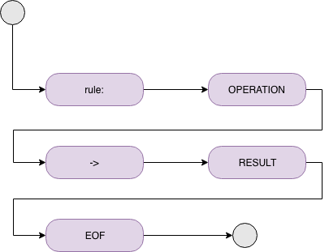

# fraudo

#### Syntax

##### OPERATIONS:
~~~~
*   count("group_field", time_in_minut)
*   countSuccess("group_field", time_in_minut)
*   countError("group_field", time_in_minut, "error_code")
*   sum("group_field", time_in_minut)
*   sumSuccess("group_field", time_in_minut)
*   sumError(("group_field", time_in_minut, "error_code")
*   unique(("group_field", "by_field")
*   in(("field", "first", "second", ...)
*   inWhiteList("field")
*   inBlackList("field")
*   like("field", "regexp_in_java_style")
*   countryBy("field")
~~~~
##### RESULTS:
~~~~
*   accept 
*   3ds
*   decline
*   notify
~~~~
##### EXAMPLES:
###### Simple:
~~~~
rule: 3 > 2 AND 1 = 1
-> accept;
~~~~
###### Black list check:
~~~~
rule: inBlackList("email")
-> notify;
~~~~
###### Counts check:
~~~~
rule: (count("ip", 1444) >= 10 OR countSuccess("email", 1444) > 5)
        AND countError("fingerprint", 1444, "error_code") > 5
-> notify;
~~~~
###### Unique count emails for ip:
~~~~
rule: unique("email", "ip") < 4
-> decline;
~~~~
###### Check country by ip:
~~~~
rule: countryBy("ip") = "RU"
-> notify;
~~~~
###### Combined check:
~~~~
rule: 3 > 2 AND 1 > 1
-> decline;

rule: count("email", 10) <= 10 AND count("ip", 1444) = 10
-> 3ds;
~~~~